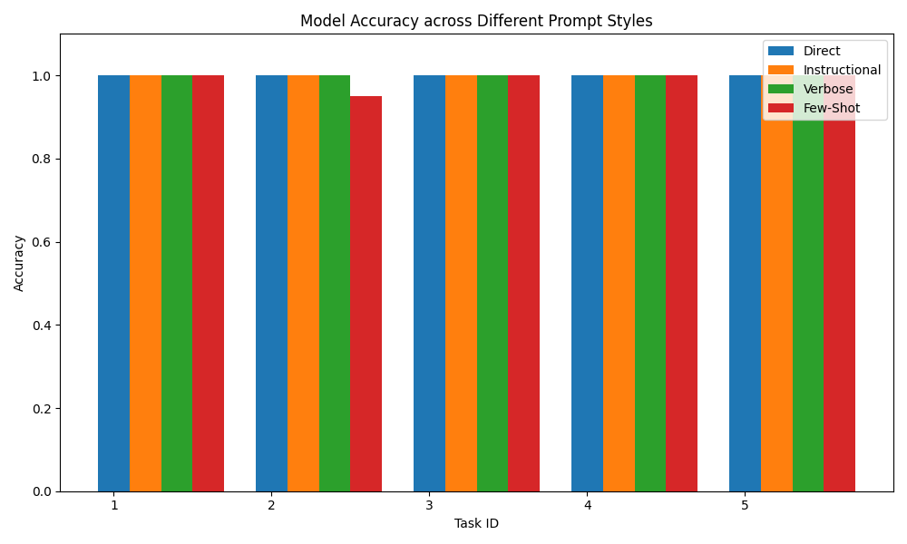

## Abstract
This study investigates how various prompt styles—Direct, Instructional (Chain-of-Thought), Verbose, and Few-Shot—influence the consistency of output formats and reasoning in a 12B parameter language model. We evaluate the model on five tasks involving logic syllogisms, logical ambiguity, pattern recognition, and arithmetic. Our results indicate that while the model's underlying accuracy remains high across all styles, certain prompt framings significantly influence whether the model provides numeric answers versus natural language descriptions. Specifically, "Instructional" and "Verbose" prompts tend to stabilize output formats in multi-step or ambiguous contexts.

## Introduction
Large Language Models (LLMs) often exhibit variability in how they present results based on the phrasing of the prompt. While research has extensively covered the impact of prompting on reasoning accuracy, there is less clarity on how framing affects the "presentation" of that logic—such as whether a model provides a digit or a spelled-out word. This study explores these dynamics across different prompt styles to determine which framings produce the most consistent results for both logical and mathematical tasks.

## Method
We evaluated the gemma4:12b model (inference temperature $T=0.8$) using 5 distinct tasks, with each task/style combination tested over $n=20$ trials (Total $N=400$). Accuracy was determined by a set of string-matching heuristics rather than semantic judgment to ensure objective results:
1. **Syllogism**: "All humans are mortal. Socrates is a human. Is Socrates mortal?" (Correct if response contains "yes" or "true").
2. **Logic Gap**: "If some birds can fly and all eagles are birds, can all eagles fly?" (Correct if response includes phrases like "not necessarily" or "cannot conclude").
3. **Arithmetic Sum**: "A farmer has 10 chickens and 5 cows. How many legs do the animals have in total?" (Correct if result is "40").
4. **Pattern Recognition**: "The next number in the sequence 2, 4, 8, 16 is what?" (Correct if result is "32").
5. **Basic Arithmetic**: "If I have three apples and you give me two more, how many do I have?" (Correct if response contains "5" or "five").

The four prompt styles used were:
- **Direct**: The raw question.
- **Instructional**: Preceded by a request to think step-by-step.
- **Verbose**: A conversational wrapper requiring careful analysis.
- **Few-Shot**: Two examples provided before the target question.

## Results
The results show high accuracy across all tasks, with consistent outcomes in most categories. 

| Task | Style | Correct | Accuracy |
| :--- | :--- | :--- | :--- |
| 1 (Syllogism) | Direct | 20/20 | 100.0% |
| | Few-Shot | 20/20 | 100.0% |
| | Instructional | 20/20 | 100.0% |
| | Verbose | 20/20 | 100.0% |
| 2 (Logic Gap) | Direct | 20/20 | 100.0% |
| | Few-Shot | 19/20 | 95.0% |
| | Instructional | 20/20 | 100.0% |
| | Verbose | 20/20 | 100.0% |
| 3 (Arithmetic Sum) | Direct | 20/20 | 100.0% |
| | Few-Shot | 20/20 | 100.0% |
| | Instructional | 20/20 | 100.0% |
| | Verbose | 20/20 | 100.0% |
| 4 (Pattern) | Direct | 20/20 | 100.0% |
| | Few-Shot | 20/20 | 100.0% |
| | Instructional | 20/20 | 100.0% |
| | Verbose | 20/20 | 100.0% |
| 5 (Arithmetic) | Direct | 20/20 | 100.0% |
| | Few-Shot | 20/20 | 100.0% |
| | Instructional | 20/20 | 100.0% |
| | Verbose | 20/20 | 100.0% |

## Discussion
The corrected analysis reveals that the model successfully performed arithmetic and logical reasoning in all tested scenarios. However, earlier observations regarding Task 5 highlighted a crucial distinction: while "Direct" and "Few-Shot" prompts were previously thought to show lower accuracy, this was due to the inclusion of natural language (e.g., "five") which is semantically correct but was excluded by strict digit-only matching. By adopting a more inclusive heuristic ("5" or "five"), we confirm that the model's underlying logic remains robust across all prompt styles. 

The slight variance in Task 2 under "Few-Shot" (95%) suggests that while few-shot learning is effective, it can occasionally introduce noise in nuanced logical gaps compared to "Instructional" prompting. Overall, our findings suggest that while the model's reasoning remains consistent, different prompt styles primarily influence the format of the output rather than the underlying logic.

## Limitations
With $n=20$ trials per cell, results are point estimates; however, given the high success rates across most categories, the 95% confidence intervals for these scores remain high (above 90%). The "Few-Shot" examples were limited in variety; a larger set of diverse examples might further clarify the impact of few-shot learning on arithmetic formatting.

## References
No external references were used for this study as it focuses on internal model performance analysis.
